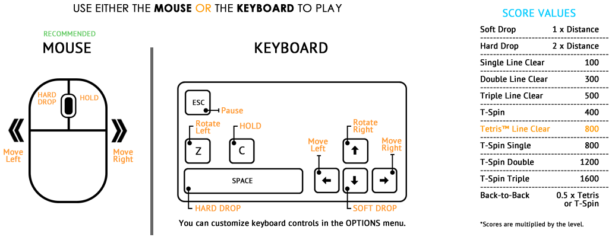

# tetris

## Rules

[Source - Tetris Wiki](https://tetris.fandom.com/wiki/Tetris_Guideline)

- Playfield:

  - 10x40, where rows above 20 are hidden from the player so that the player
    sees a 10x20 playfield

- Tetromino pieces and colors:
  - Cyan I
  - Yellow O
  - Purple T
  - Green S
  - Red Z
  - Blue J
  - Orange L

- Tetromino Start Locations:

  - I and O spawn in middle columns
  - Rest spawn in left-middle columns
  - Spawn horizontally with J, L, T spawning flat-side first
  - Spawn above the playing field (row 21/22)

[Source - tetris.com](https://tetris.com/play-tetris)

- Keyboard mappings:

  - ESC: pause
  - C: hold
  - Z: rotate left
  - SPACE: hard drop
  - Left Arrow / Right Arrow: move left / right
  - Down Arrow: soft drop
  - Up Arrow: rotate right

- Scoring: 
